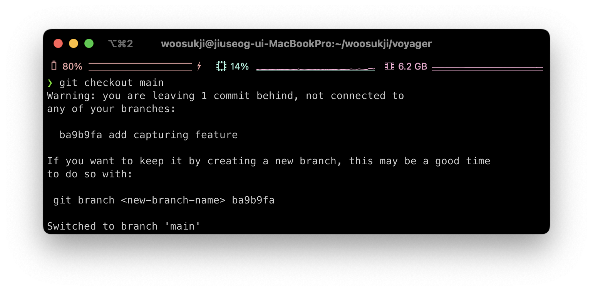

# TIL

## Git cherry-pick

오늘은 한 브랜치에서 옛날 커밋을 checkout한 상태로 작업하다가, 변경사항을 그대로 그 위에 커밋해버렸다.
이런 경우, 새로운 커밋은 해당 브랜치에서 벗어나  `detached HEAD` 상태가 되고, 다른 브랜치로 이동하고 나면 `git log --all` 등으로 확인할 수 없어져서, 그 커밋을 잃어버릴 수가 있다.

<p>
    
    <em>위와 같이 detached head 커밋에서 다른 브랜치로 벗어나려고 하면 경고를 준다.</em>
</p>

이런 경우,  `detached HEAD` 가 된 커밋을 포함하는 브랜치를 만들어 줄 수 있다.
```shell

$ git branch <new-branch-name> <detached-commit-hash>
```

혹은, 아직 해당 커밋을 떠나지 않았을 경우 현재 커밋을 감싸는 브랜치를 만들 수 있다.
```shell

$ git switch -c <new-branch-name>
```
하지만 나는 이렇게 브랜치를 따로 만들어서 머지해줌으로써 실수를 기록으로 남기고 싶지 않았고, 어차피 원래 브랜치도 리모트(github)에서는 삭제했었기 때문에, 해당 커밋만을 `main` 브랜치로 가지고 오기 위해 `git cherry-pick`을 사용했다.

```shell

// 현재 브랜치로 가져오고 싶은 커밋 해시들 나열
$ git cherry-pick <commit to pick> <commit to pick 2>

// from...to -> 사이에 있는 커밋들 모두 가져오기
$ git cherry-pick <pick commit from>...<pick commit to>
```

그런데, `git cherry-pick`을 하자 다음과 같은 에러를 내며 종료했다.
```
error: The following untracked working tree files would be overwritten by merge:
	voyager.xcworkspace/xcshareddata/IDEWorkspaceChecks.plist
Please move or remove them before you merge.
Aborting
fatal: cherry-pick failed
```

제일 최근 커밋에서 추가된 파일인데, 다른 브랜치를 checkout할 때 왠지 모르게 사라지지 않고 남아있다가 해당 커밋을 다시 추가하려고 하니 덮어씌워진다는 오류를 준 것이다.
해당 파일을 삭제하고 `git cherry-pick --continue`를 하니 문제없이 마무리되었다.

# Reference

[git 명령어 : git cherry-pick](https://cselabnotes.com/kr/2021/03/31/56/)


