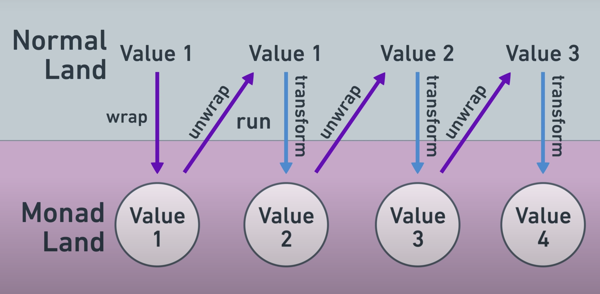

# TIL

## What is Monad?

### 초기 상황

아래와 같이, Number 자료형에 `square`, `addOne` 등 다양한 transform 함수를 적용하면서, 함수를 먹일 때마다 log를 남기려 하는 상황이다.

```typescript
function square(x: number): number {
	return x * x
}

function addOne(x: number): number {
	return x + 1
}

addOne(square(2)) 	// 5
```

### 첫번째 시도: 래퍼 객체로 감싸서, 로그 쌓는 기능 추가

아래와 같이 number을 감싸는 래퍼 객체로 로그 기능을 추가한다. 이 경우, transform 함수였던 `square`, `addOne` 이 `number`이 아닌 래퍼 객체인 `NumberWithLogs` 를 다루게 되면서 로그를 추가할 수 있다.

➡️ ❌ **단점: `concat`으로 로그를 쌓는 로직이 중복됨!**

```typescript
interface NumberWithLogs {		// number을 로그와 함께 감싸는 래퍼 객체
	result: number
	logs: string[]
}

function wrapWithLogs(x: number): NumberWithLogs {
	return {
		result: x,
		logs: []
	}
}

function square(x: NumberWithLogs): NumberWithLogs {
	return {
		result: x.result * x.result,
		logs: x.logs.concat([
			`Squared ${x.result} to get ${x.result * x.result}`
		])
	}
}

function addOne(x: NumberWithLogs): NumberWithLogs {
	return {
		result: x.result + 1,
		logs: x.logs.concat([
			`Added 1 to ${x.result} to get ${x.result + 1}`
		])
	}
}

square(addOne(wrapWithLogs(2)) 	// 9
```

만약에, 아래와 같이 써 본다면? 
➡️ 함수가 만드는 `newNumberWithLogs` 객체의 구조가 단순해진다 (`logs`가 eleme`nt 1개짜리 list면 됨). 이후 concat 하는 부분을 분리해보자.

```typescript
function addOne(x: NumberWithLogs): NumberWithLogs {
	const newNumberWithLogs = {
		result: x.result * x.result,
		logs: [`Squared ${x.result} to get ${x.result * x.result}`]
	}
	return {
		result: newNumberWithLogs.result,
		logs: x.logs.concat(newNumberWithLogs.logs)
	}
}
```

### Monad 개념을 활용한 해결

아래와 같이, `runWithLogs()` 함수를 통해 log을 쌓는 처리를 담당하고, transform 함수들의 로직을 단순화할 수 있다.

```typescript
function runWithLogs(
	input: NumberWithLogs,
	transform: (_: number) => NumberWithLogs
): NumberWithLogs {
	const newNumberWithLogs = transform(input.result)
	return {
		result: newNumberWithLogs.result,
		logs: input.logs.concat(newNumberWithLogs.logs)
	}
}

function square(x: number): NumberWithLogs {
	return {
		result: x * x,
		logs: [`Squared ${x} to get ${x * x}`]
	}
}

/* addOne 구현도 동일 */

const a = wrapWithLogs(5)
const b = runWithLogs(a, addOne)
const c = runWithLogs(b, square)
```


### Monad의 개념과 구성요소

이와 같이, monad가 전,후처리를 담당해서 chaining operation이 가능하도록 만들어주는 것이 디자인 패턴으로서의 monad이다.

Monad는 다음 세가지의 요소로 이루어진다.

1. Wrapper Type: `NumberWithLogs`에 해당. 
2. Wrap Function: `wrapWithLogs()`에 해당. monad ecosystem에 엔트리포인트를 만들어줌. `return`, `pure`, `unit`이라고도 함
3. Run Function: `runWithLogs()`에 해당. monadic values에 transformation을 실행함. `bind`, `flatMap`, `>>=` 이라고도 함

Monad를 사용할 때의 데이터 흐름은 아래 그림과 같다.

  

1. Wrap Function을 통해 데이터를 "monad land"로 들인다.
2. Run Function에서 monad를 unwrapping하고, 이 때 'Behind the scenes' 작업을 한다.
3. Unwrapped 객체에 사용자가 정의한 transform을 적용한다.

이렇게 한다면, 주요 로직을 감싸고 있는 주변 작업들이 '없는 것처럼' 작업할 수 있다.

### Monad의 또 다른 예시

아래 예시는 `Option<T>`로 nullable 객체를 래핑할 때의 monad 개념을 보여준다.
```typescript
// Wrap Function
function some<T>(x: T): Option<T>

// Run Function
function run<T>(
	input: Option<T>,
	transform: (_:T) => Option<T>
): Option<T> {
	if (input == none) {
		return none
	}

	return transform(input.value)
}
```


이 외에도, Future/Promise와, List도 monad 개념으로 해석할 수 있다.

`NumberWithLogs` monad을 통해 log accumulation 작업을 숨기고 (hide away), `Option` monad을 통해 null 값을 처리하는 작업을 숨겼던 것처럼, Future/Promise는 아직 사용할 수 없는 값의 처리를 숨긴다. 

List를 monad 개념으로 해석할 경우, transform function은 각 element에 대해 list를 산출하는 함수이고, Runner Function은 `flatMap()` 함수이다.

# Reference

[[YouTube] The Absolute Best Intro to Monads For Software Engineers](https://www.youtube.com/watch?v=C2w45qRc3aU)


