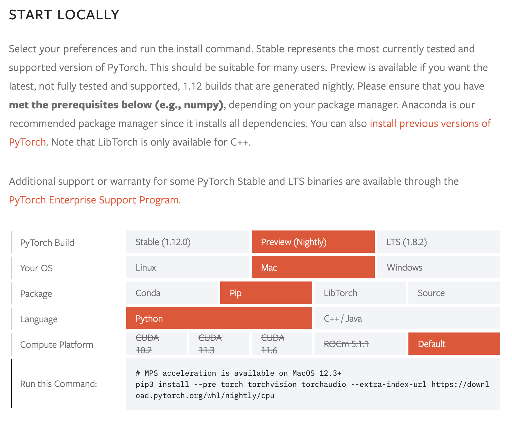
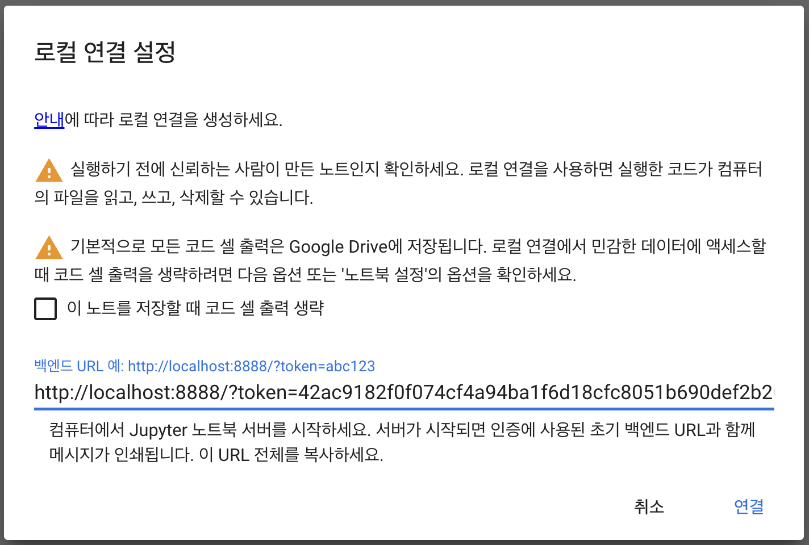
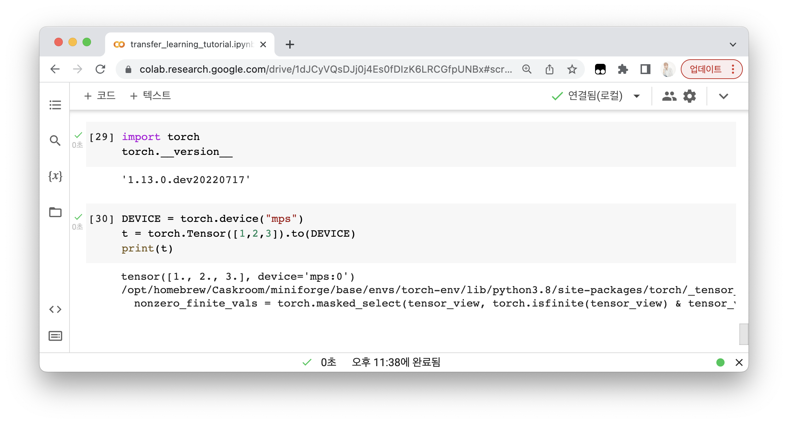

# TIL

## PyTorch M1 GPU 가속 (MPS module) 테스트 후기 - 1️⃣ torch 환경 구축, Colab 로컬 런타임 연결

### 요약

1. 아주 작은 모델을 CPU에서 돌릴 때에는 M1이 Colab보다 훨씬 빨랐다.
2. 의미 있는 사이즈의 모델을 GPU에서 돌릴 때에는, (이것저것 조정하면) Colab 기본계정과 비슷한 퍼포먼스를 보인다.
3. 아직 PyTorch의 M1 GPU 지원은 커버리지와 최적화가 덜 되었지만, 가끔 쓸모는 있을 듯하다.


---


최근 Colab 기본 계정에서 GPU 런타임이 점점 하향조정되고 있다는 느낌을 받았다. 기본적으로 P100, 또는 A100도 가끔 보이던 작년에 비하면, 요즘 기본 계정으로는 사실상 최저인 T4로 굳어진 듯 하다. (T4는 2018년 출시된 늙은이로 딥러닝 벤치마크에서 2060 수준의 성능이다...)

M1 Pro가 달린 맥북프로도 샀겠다, 그렇게 자랑하시던 S-O-C GPU를 로컬 런타임으로 활용하면 Colab 인스턴스보다 낫지 않을까? 해서 테스트해보게 되었다.

### PyTorch MPS Acceleration

최근 22년 5월, 파이토치에서 드디어 M1 GPU 가속을 지원하는 버전을 발표했다. Apple 기기에서 CUDA와 같은 역할을 하는 GPU 연산 최적화 라이브러리인 MPS(Metal Performance Shader)을 딥러닝 연산에 활용하는 것이다.

내가 구축하고 싶었던 환경은 크게 두 가지 요소로 이루어졌다.

1. M1 GPU 가속을 이용하는 PyTorch 사용하기
2. Colab에 로컬 런타임으로 연결해서, 맥북 프로의 강력한 성능 누리기

굳이 로컬을 사용하면서 귀찮게 Colab에 연결하기로 한 이유는 몇 가지가 있는데,

- 주피터 노트북보다는 코랩 환경에 익숙해져 있다.
- 코랩의 편의기능 (파일 디렉토리 뷰어, 코드 자동완성, 셀 실행시간 표시 등 디테일하게 편함)이 잘 되어있다.
- 로컬 런타임이라니.. 뭔가 힙하다 (사실상 M1 파이토치에서 힙함의 절정)


### Conda 환경 생성 & 라이브러리 설치

PyTorch Nightly 버전을 설치해야 하므로, conda 환경으로 격리하는 과정이 필수적이다.

```shell
$ conda create --name torch-gpu-env python=3.8

$ conda activate torch-gpu-env

// 현재 설치된 패키지 목록
$ conda list
```

우선, 고대하던 M1 지원버전 PyTorch를 설치해보자.

글을 작성하는 시점에는 conda 채널을 통한 설치가 지원되지 않는다 (불안정 빌드이기 때문인 것으로 추정). 따라서 pip를 이용해 설치한다. 

[PyTorch 공식 안내문서](https://pytorch.org/get-started/locally/)에서, 사진과 같이 환경에 맞게 조건을 선택하면 설치 커맨드가 뜬다. 



그런데, 안내하는 대로 `pip3`를 사용하면 conda 환경이 아닌 pip3 (파이썬 설치 시 딸려온) 환경에 글로벌하게 설치되므로, conda에 포함된 `pip` 커맨드로 바꿔 설치해줬다.

```shell
$ pip install --pre torch torchvision torchaudio --extra-index-url https://download.pytorch.org/whl/nightly/cpu
```

다음으로, Jupyter notebook과 이를 Colab에 런타임으로 호스팅할 수 있도록 패키지를 설치한다.

Colab 로컬 런타임에 대한 설명은 [공식 안내문서](https://research.google.com/colaboratory/local-runtimes.html)에서 참고했다.

```shell
$ conda install jupyter jupyter_http_over_ws

$ jupyter serverextension enable --py jupyter_http_over_ws
```

이제, 다음 커맨드를 실행하면 주피터 노트북 서버를 열 수 있다.

```shell
$ jupyter notebook \
  --NotebookApp.allow_origin='https://colab.research.google.com' \
  --port=8888 \
  --NotebookApp.port_retries=0
```

마지막으로, 실행하고 싶은 Colab 노트북을 열어 우상단의 '연결' > '로컬 런타임에 연결' 을 선택한 후, 위의 마지막 커맨드에서 출력된 주피터 노트북 서버 URL을 입력한다.



이제 모든 세팅이 완료되었다!

Torch Tensor를 생성해서, 평소처럼 `"cuda:0"`이 아닌 `"mps"`로 보내서 확인해보자.


